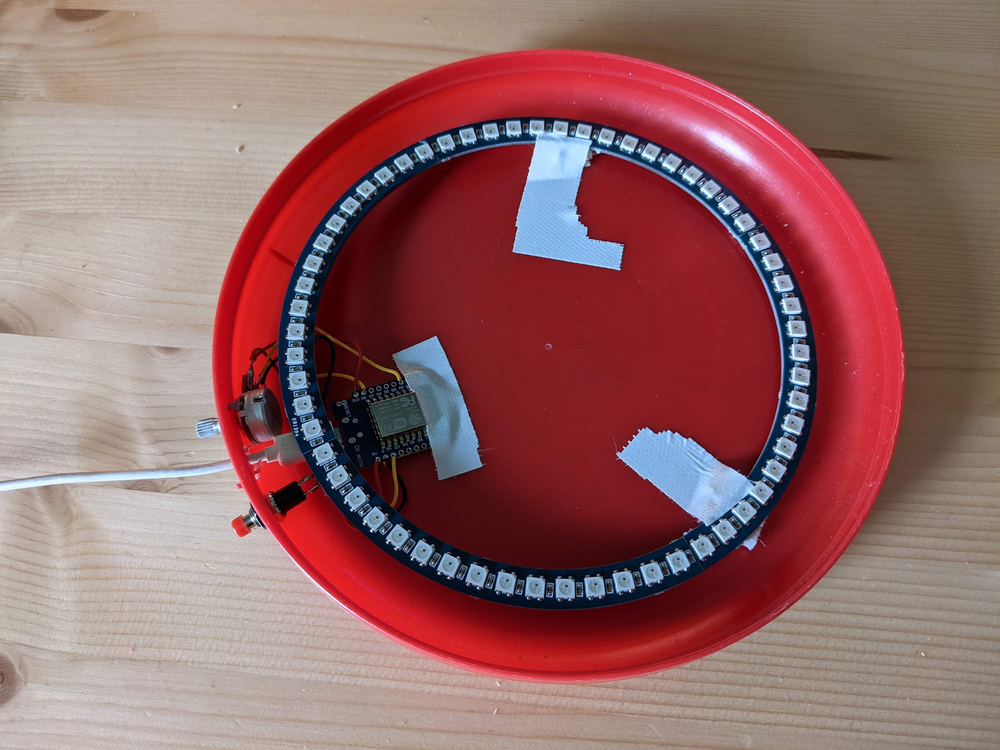
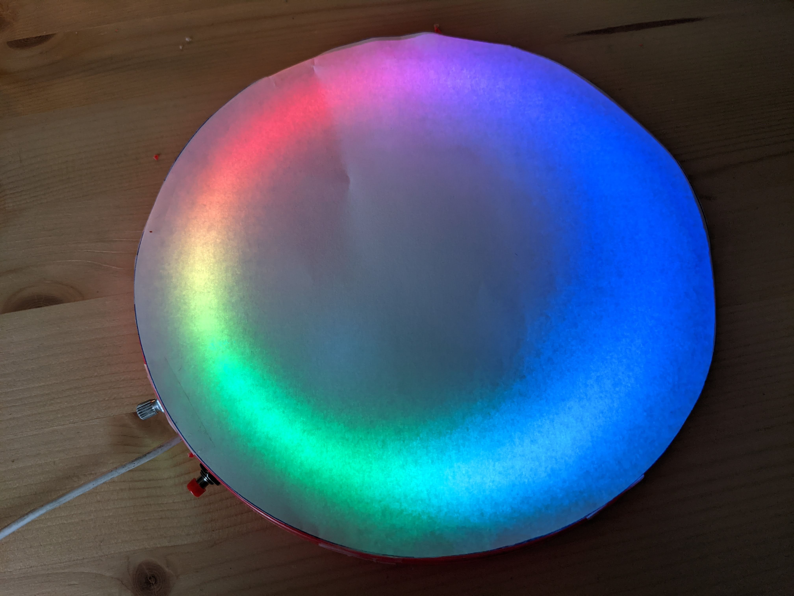
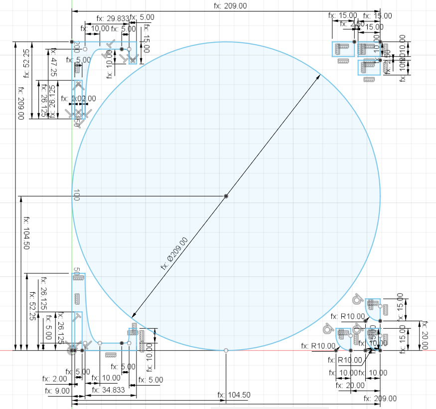

# Behuizing
We hebben heel mooi plexiglas besteld, maar dat is nog niet aangekomen. Dit hoofdstuk wordt uitgebreid zodra dat binnen is. Je kunt voor nu alles in de frisbee tapen.

Gebruik een vel A4 papier om het licht mooi difuus licht te krijgen. Als je wit bakpapier gebruikt kun je de pixels beter zien en komt er meer licht doorheen.

## Zelf lasersnijden
Heb je zelf een lasersnijder en een plexiglas plaat van 5 milimeter dik dan kun je de behuizing zelf snijden. Download het lasersnij bestand [hier](./assets/files/tekening-lasercut.dxf). Kijk in onderstaande afbeelding voor de afmetingen.

