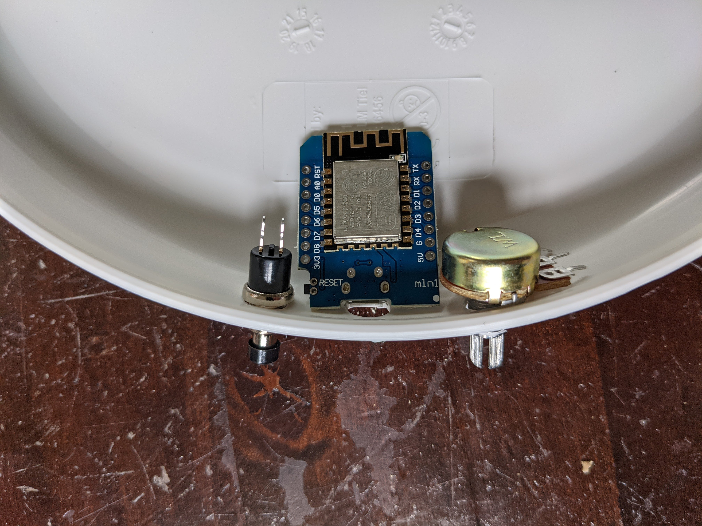
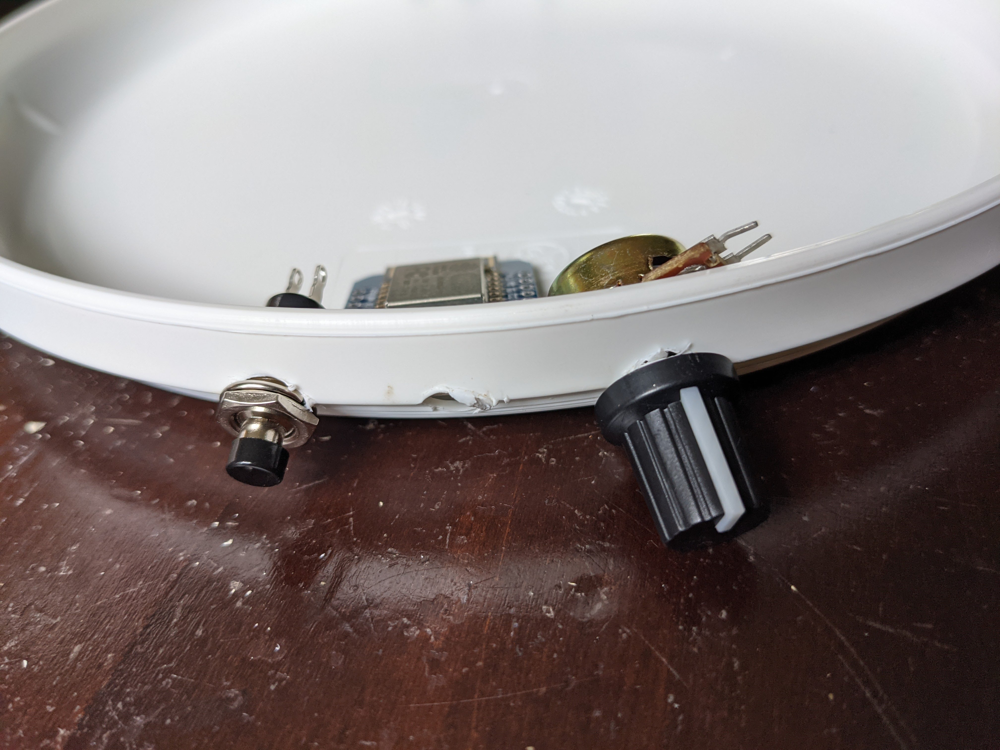

# Behuizing
Helaas was het niet mogelijk om een plexiglas voorplaat te laten maken voor deze workshop. Door de pandemie en alle corona kuchschermen is plexiglas slecht leverbaar. Maar niet getreurd, alle elektronica kan in de frisbee bevestigd worden en een papiertje kan gebruikt worden als diffuuse voorkant.

## Bevestigen knopje en potentiometer
Maak drie gaten in de onderkant van de frisbee. Hier kun je het beste een houtboor voor gebruiken. Let er op dat de afstand tussen de gaten voldoende is zodat alle onderdelen naast elkaar passen.

!!! warning "Gebruik niet je soldeerbout om de gaten te maken"
    Als je dat wel doet kun je de soldeerbout weggooien want dan is hij niet meer bruikbaar om mee te solderen.

Je kunt vervolgens het knopje en de potentiometer bevestigen met de meegeleverde ringetjes en moertjes. Druk vervolgens het dopje op de potentiometer.

## Bevestigen elementen
Je kunt voor nu alles in de frisbee tapen. Zorg er voor dat de hoogte van de ledring ten opzichte van de frisbee constant is. Zo is de belichting mooi uniform. Hoe verder je de ledring naar voren plaatst hoe duidelijker de individuele pixels te zien zijn.

Gebruik een vel A4 papier om het licht mooi difuus licht te krijgen. Als je wit bakpapier gebruikt kun je de pixels beter zien en komt er meer licht doorheen.

## Zelf lasersnijden
Heb je zelf een lasersnijder en een plexiglas plaat van 5 milimeter dik dan kun je de behuizing zelf snijden. Download het lasersnij bestand [hier](./assets/files/tekening-lasercut.dxf). Kijk in onderstaande afbeelding voor de afmetingen.

