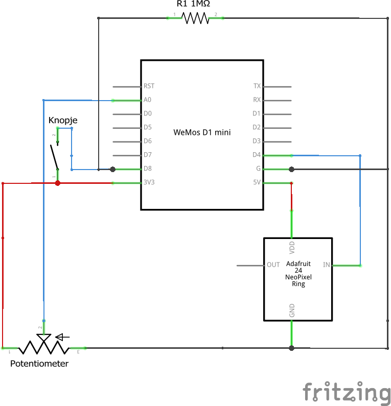
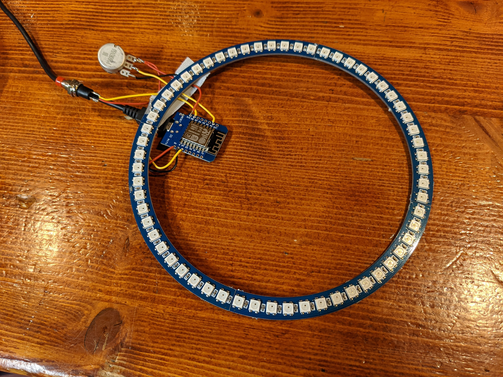

# Hardware overzicht
Tijdens deze IoT workshop gaan we een IoT lamp maken. dit is het schema voor het te solderen circuit:

En als het solderen gelukt is dan moet het eindresultaat er ongeveer zo uit komen te zien!

## Draden voorbereiden
Als het goed heb zitten er 3 draden van 15cm in de kit. Knip deze draden in stukken van 5 cm en strip de isolatie van de uiteinden zodat deze gesoldeerd kunnen worden.
