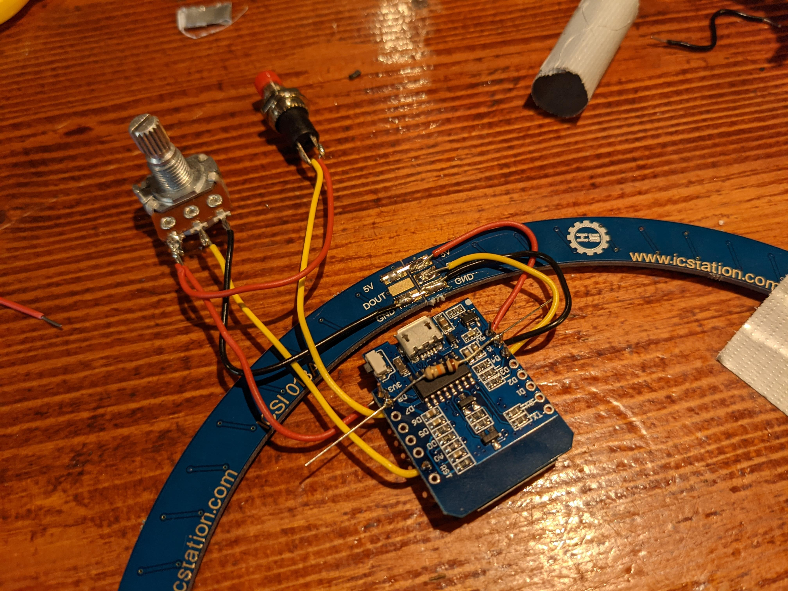

# Knopje
!!! tip "Dit is een goed moment om je hardware te testen"
    Tenzij je erg veel zelfvertrouwen hebt raden we je aan om op dit moment je hardware te testen. Controleer eerst goed of geen van je draden elkaar raken waar dat niet zou moeten. Plaats zo nodig preventief wat tape. Volg de stappen in [Arduino IDE](../software]) om vervolgens de [test code](../software/#test-code) uit te voeren. Als alles correct aangesloten is zal er een regenboog over de ledring cirkelen. Door aan de draaiknop te draaien moet deze sneller of langzamer gaan draaien. Als je het knopje indrukt moet deze stoppen met draaien. Werkt alles? Gefeliciteerd! Dan kun je nu door naar de behuizing.
    
 Knoppies! Helemaal leuk! Eigenlijk is een knopje net zoals een ophaalbrug. Wanneer de ophaalbrug open is kan er geen verkeer door heen en wanneer deze weer dicht is kan je er weer over heen fietsen. Zo gaat het met een knopje ook. 
Een knopje overbrugt een gat in een circuit. Als er een gat is het circuit zit betekent dit dat de stroom niet verder kan. Wanneer een knopje dan ingedrukt wordt, wordt er als het ware een brug gecreëerd waardoor de stroom weer verder.
    

    

