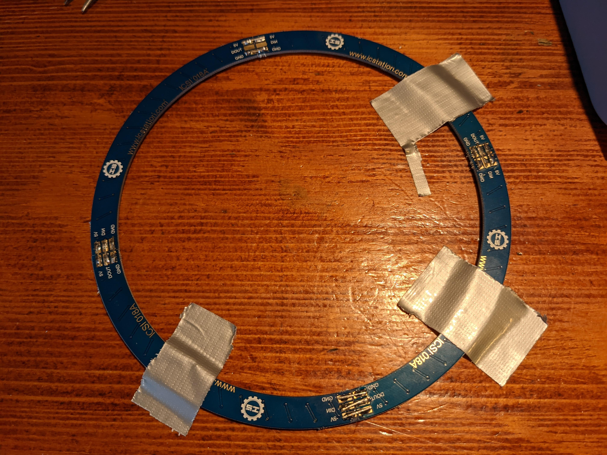
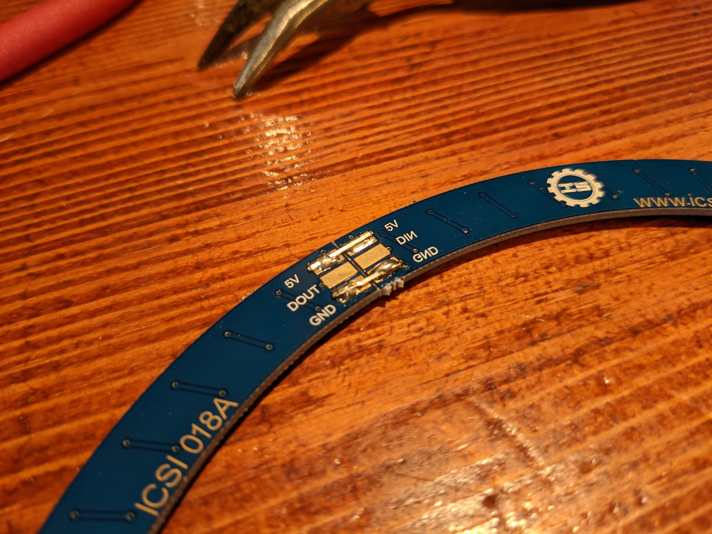
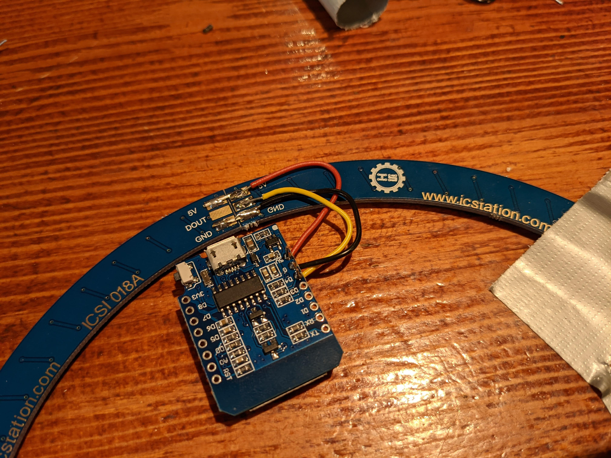

# Ledring

We beginnen met de leukste stap, het solderen van de ledring!

## Ring solderen

We raden aan om de ledring op tafel vast te plakken voordat je begint met solderen. Je hebt als het goed is een strip met metalen pinnetjes gekregen. Die kun je uit de strip trekken en op de ring solderen. Verbind alle `GND` en `5V` vlakken met elkaar. Verbind ook de `DIN` en `DOUT` vlakken met elkaar voor de data verbinding **op één na**. Dit zal straks het begin en einde van de ledring zijn. Het solderen van de ledring is best een priegel werkje, in [deze video](https://cloud.rubensmit.com/s/SRYYPAWBZGkcFnM) kun je wat tips zien hoe je dit het beste doet. 

In deze closeup kun je de verbindingen zien. Hier zie je het begin en einde van de ledring.

## Ring aansluiten

Vervolgens moet de ledring aangesloten worden op de ESP. Soldeer daarvoor draden tussen de `GND` pin van de ESP en het `GND` vlak van de ledring, de `5V` pin van de ESP en het `5V` vlak van de ledring. Voor de dataoverdracht tussen de ledring en de ESP moet je een draad solderen tussen de `D4` pin van de ESP en het `DIN` vlak van de ledring. Let goed op dat deze draad niet per ongeluk het `DOUT` vlak raakt want dan werkt de ring niet.

