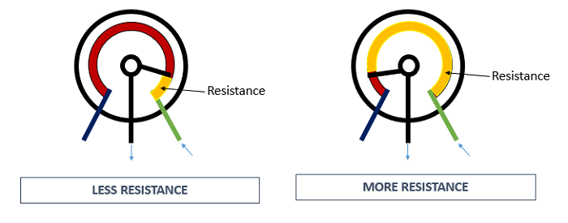

# Potentiometer
We hebben het net over een voltage divider gehad. Allemaal leuk en aardig maar wat nou als ik steeds mijn output voltage wil veranderen. Ik ga niet steeds mijn weerstand combinatie veranderen. Heel begrijpelijk, gelukkig heeft het leven hier een oplossing voor: een potentiometer! 

Een potentiometer is een verstelbare weestand die bestaat uit weerstandsmateriaal (dit ‘remt’ de stroom als het ware af) en een loper/slede. De stand van de slede kan je veranderen door aan de knop te draaien. Dit kan omdat een potentiometer drie pootjes heeft. Voor nu noemen we ze even A,B en C. De buitenste pootjes zijn A en C die zitten vast aan het weerstandmateriaal. Pootje B zit vast aan de slede. 

Wanneer je dit circuit aansluit om stroom dan ga je twee van deze pootjes verbinden, dus je verbindt of pootje A en B of je verbindt B en C. Wanneer dit gebeurd moet de stroom door het weerstandsmateriaal. Hoe langer de weg van het ene pootje naar het andere pootje hoe groter de weerstand.

