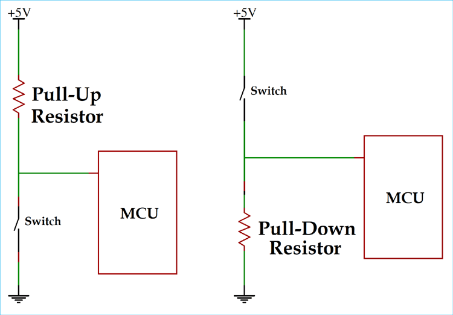

# Pull-down resistor
!!! info "Je kunt dit hoofdstuk overslaan als je alleen maar wilt bouwen"
    We willen je graag wat achtergrondinformatie geven over het aansluiten van bepaalde componenten. Deze basis zou voldoende moeten zijn om de meeste componenten op een Arduino aan te kunnen sluiten. Oftewel, om alles te bouwen wat je maar zou willen.

Pull-down resistors zijn weerstanden die een hele belangrijke rol hebben in veel schakelingen waarin een digitale sensor de spanning meet. Dat kan al bij een drukknopje zijn die kleine stroompulsjes van 5V stuurt.

Wanneer zo’n knopje niet is ingedrukt zou er dus 0V naar een chip moeten gaan maar stiekem is dat niet zo. Vaak is er van allerlei ruis dus wel kleine stroompulsjes richting de digitale input pin. Zo’n digitale input pin meet alleen maar 0V of 5V en wanneer er ruis is kan de ‘trigger drempel’ van zo’n digitale pin worden bereikt waardoor die pin denkt dat er 5V doorheen gaat terwijl die eigenlijk helemaal niet zo is. Moker irritant natuurlijk.

Om dit soort dingen te voorkomen kunnen we een hele grote weerstand plaatsten tussen de digitale in pin en de ground. Dit zorgt ervoor dat de digitale in pin verbonden is met de grond en dus altijd 0V meet wanneer de knop niet is ingedrukt.

Wanneer de knop wel wordt ingedrukt wordt de digitale IN pin verbonden met 5V en zal hij dus 5V meten.

