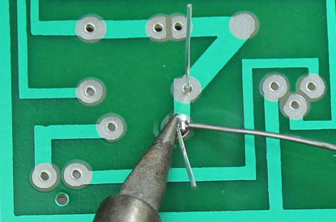

# Solderen

!!! info "Je kunt dit hoofdstuk overslaan als je alleen maar wilt bouwen"

Solderen is een techniek die iedereen die wat met elektronica doet zou moeten beheersen. Door middel van solderen kun je twee elektronische onderdelen met elkaar verbinden en ontstaat er een stevige (elektronische) verbinding. We zullen kort uitleggen welk gereedschap hiervoor nodig is en hoe je verschillende onderdele soldeert. Ook zullen we uitleggen hoe je fouten kunt corrigeren door middel van desolderen.

## Soldeergereedschap

Je hebt niet heel veel gereedschap nodig om te solderen. Hieronder beschrijven we de basis benodigdheden.

### Soldeerbout

{ align=left }

De soldeerbout gebruik je om het soldeer mee te verhitten zodat het aan de elektische componenten gesmolten kan worden. Ze komen in twee varianten, pen en pistool vorm. Voor beginners is de pen vorm het handigst. Probeer er een te kopen waarvan de temperatuur instelbaar is en met een wattage tussen de 15W en 30W. De meeste soldeerbouten hebben een verwisselbare punt. Er zijn twee gangbare vormen hierin, de conische en de platte punt. Conische punten worden vooral gebruikt voor het precies solderen van kleine componenten, platte punten voor grotere componenten en draden. Voor beginners is een conische punt aan te raden.

!!! danger "Een soldeerbout kan extreem heet worden!"
    Ja duh! Maar goed, we willen toch even waarschuwen want als je niet oppast kun je je akelig verbranden of brand veroorzaken. Doe voorzichtig. Tot zover ons verantwoordelijkheidsgevoel.

### Spons

Het is belangrijk om de punt van je soldeerbout schoon en vrij van oxidatie te houden. Daarvoor kan een spons gebruikt worden. Punten met oxidatie worden zwart en accepteren geen soldeer meer. Je kunt hiervoor een vochtige conventionele spons gebruiken, maar dit verkort wel de levensduur van je punt. Een alternatief is gebruik te maken van een messing spons.

!!! warning "Gebruik geen schuurspons maar een cellulose spons"
    Schuursponzen zijn gemaakt van plastic en dat smelt bij de hoge temperaturen van de soldeerbout. Gebruik in plaats daarvan een natuurspons of een speciale cellulose soldeerbout spons.

### Soldeer

Soldeer is een metaallegering met een laag smeldpunt. Het bestaat in zowel loodhoudende als loodvrije variaties in draadvorm. In de kern van de draad zit een materiaal genaamd flux, dit zorgt voor een betere soldeerverbinding. De meest gebruikte variant soldeer is loodvrijde soldeer met harskern. De loodhoudende variant is minder populair vanwege gezondheidsrisico's.

De optimale soldeertemperatuur bij loodhoudende soldeer is rond de 330°C. Voor loodvrije soldeer is dit 350°C.

!!! danger "Let op bij het gebruik van loodhoudende soldeer"
    Zorg voor goede ventilatie en was je handen naderhand. De dampen kunnen schadelijk zijn voor je gezondheid.
    
### Overig

Een houder voor je soldeerbout is aan te raden als je vaker soldeert, daarmee voorkom je dat je brandt aan de punt of iets in de fik zet. Een ander handig hulpmiddel bij het solderen is een "helpend handje". Met de klemmetjes kun je twee componenten bij elkaar houden zodat je je handen vrij hebt om te solderen. Een goedkoop alternatief hiervoor is houten knijpers en ijzerdraad. 

## Veiligheid

Zorg er voor dat je soldeert in een goed geventileerde ruimte. Bij het solderen komen schadelijke dampen vrij die slecht zijn voor je ogen en je longen. Was achteraf altijd je handen. Zorg voor een ondergrond die hittebestendig is en gebruik hulpmiddelen zoals tangetjes om de materialen die je aan elkaar soldeert vast te houden.

## Soldeerpunt vertinnen

Voordat je begint met solderen en nadat je klaar bent met het solderen is het slim om de punt van je soldeerbout te vertinnen. Hiermee verbeter je de hitteoverdracht van je soldeerbout en gaat het solderen een stuk makkelijker. Daarnaast voorkomt het slijtage aan de punt en ontstaat er minder oxidatie.

1. Controleer of de punt goed vastgeschroeft zit voor een optimale hitteoverdracht.
2. Zet je soldeerbout aan en stel hem, indien mogelijk in de juiste temperatuur in voor je soldeer.
3. Maak, wanneer de soldeerbout heet is, de punt van je soldeerbout schoon met een vochtige spons of een messing spons.
4. Coat de punt van je soldeerbout in een dun laagje soldeer.

## Componenten solderen

Je soldeert als volgt een component aan een printplaat.

1. Steek de draad door het gat in de printplaat en buig hem ongeveer 45 graden. Op deze manier blijft de draad goed zitten en krijg je een betere verbinding bij het solderen.  

2. Verhit de verbinding. Dit doe je door met de soldeerpunt zowel het koper op de printplaat en de draad aan te raken. Doe dit voor ongeveer 3 tot 4 seconden om de twee goed op te warmen.  

3. Voeg soldeer toe aan de verbinding. Terwijl de de soldeerpunt op zijn plek houdt voeg je soldeer toe. `Let op` raak met de soldeer niet de soldeerpunt aan maar de verbinding zelf. De verbinding moet heet genoeg zijn om de soldeer te smelten, anders krijg je geen goede verbinding.  

4. Knip de draden kort af. Laat de verbinding eerst rustig en natuurlijk afkoelen. Dit zorgt voor de meest stevige verbinding.  

Een goede soldeerverbinding is glad en glanzend en lijkt op een vulkaan of kegelvorm. Er is net genoeg soldeer om de hele verbinding te bedekken maar niet zoveel dat het een balletje vormt.

Wil je dit graag in een mooie video uitgelegd krijgen, kijk dan deze youtube video: [https://www.youtube.com/watch?v=kTURB6QboNY](https://www.youtube.com/watch?v=kTURB6QboNY).

## Draden solderen

Zo soldeer je twee draden aan elkaar.

1. Verwijder de isolatie van beide draadeinden. Als het een gevlochten draad is draai je de draden in elkaar in je vingers.  

2. Met een hete soldeerbout raak je de punt van het draad aan zodat hij in 3 tot 4 seconden goed opwarmt.  

3. Vervolgens raak je de draad aan met het soldeer. Hiermee leg je een dunne coating van soldeer aan om de draad. Doe dit ook voor de andere draad. Zorg ervoor dat je niet de punt van je soldeerbout aanraakt met de soldeer.  

4. Houd de twee draden tegen elkaar en raak ze aan met de punt van je soldeerbout. Hiermee zouden de beide gecoate draden aan elkaar moeten smelten.  

## Desolderen

Het mooie aan solderen is dat je fouten kunt herstellen. Daarvoor kun je een verbinding desolderen met een desoldeerlont (ookwel desolderbraid of desolderwick). Deze kan overtollig soldeer "opzuigen".

Plaats de lont op de verbinding die je wilt desolderen. Vervolgens verhit je de lont met je soldeerbout. Als het goed is wordt de soldeer in de lont opgenomen.
