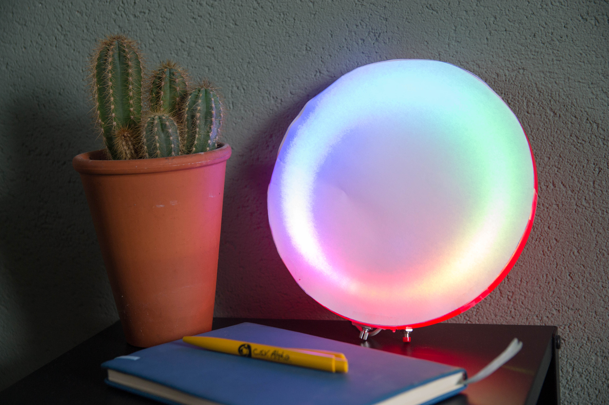

# IoT Workshop - Solderen en programmeren

Welkom bij de Internet of Things Workshop van C.S.V. Alpha. In deze handleiding zul je alle informatie vinden die nodig is om de ledring in elkaar te zetten. Ook zijn er een aantal voorbeeld projecten toegevoegd waarmee je kunt leren hoe je microcontrollers kunt programmeren.

Deze handleiding bestaat uit drie delen. Allereerst een beschrijving hoe de hardware in elkaar gezet moet worden. Vervolgens hoe deze in de behuizing geplaatst moet worden. Daarna wordt beschreven hoe je code naar de microcontroller kunt uploaden en hoe je de verschillende onderdelen van de microcontroller programmeerd.

## Benodigdheden
Voor deze workshop zijn een aantal benodigdheden. Het gros hiervan wordt bij de workshop mee geleverd. Het is mogelijk om ook een telefoonlader en/of soldeerbout te bestellen mocht je deze niet hebben. Natuurlijk kun je ook altijd de soldeerbout van iemand anders lenen.

### IoT workshop kit
| Artikel                  | Aantal  |
|--------------------------|---------|
| WEMOS D1 Mini            | 1       |
| 10K Ohm potentiometer    | 1       |
| Push button              | 1       |
| 1M Ohm weerstand         | 1       |
| WS2812 60 pixel led ring | 1       |
| Strip header pins        | 1       |
| Draad Rood               | 10 cm   |
| Draad Zwart              | 10 cm   |
| Draad Geel               | 10 cm   |
| Frisbee Wit              | 1       |
| Plexiglas schijf         | 2       |
| Soldeertin               | 1 strip |

### Zelf aanleveren
| Artikel                             | Aantal |
|-------------------------------------|--------|
| 5V 1,5A USB voeding (telefoonlader) | 1      |
| Micro USB kabel                     | 1      |
| vel A4 papier                       | 1      |

### Gereedschap
| Artikel                                                        |
|----------------------------------------------------------------|
| Soldeerbout                                                    |
| Schaar                                                         |
| Tape                                                           |
| Lijm                                                           |
| Boor (of ander gereedschap om een gat in een frisbee te maken) |