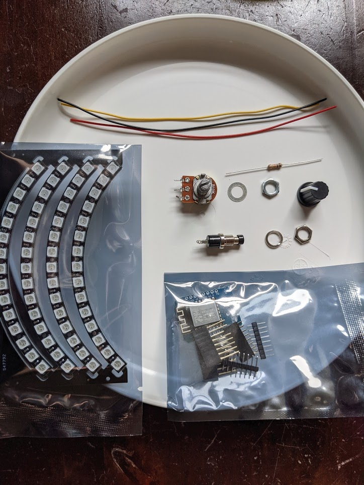

# IoT Workshop - Solderen en programmeren

Welkom bij de Internet of Things Workshop van C.S.V. Alpha. In deze handleiding zul je alle informatie vinden die nodig is om de ledring in elkaar te zetten. Ook zijn er een aantal voorbeeld projecten toegevoegd waarmee je kunt leren hoe je microcontrollers kunt programmeren.

Deze handleiding bestaat uit drie delen. Allereerst een beschrijving hoe de hardware in elkaar gezet moet worden. Vervolgens hoe deze in de behuizing geplaatst moet worden. Daarna wordt beschreven hoe je code naar de microcontroller kunt uploaden en hoe je de verschillende onderdelen van de microcontroller programmeerd.

## Benodigdheden
Voor deze workshop zijn een aantal benodigdheden. Het gros hiervan wordt bij de workshop mee geleverd. Het is mogelijk om ook een telefoonlader en/of soldeerbout te bestellen mocht je deze niet hebben. Natuurlijk kun je ook altijd de soldeerbout van iemand anders lenen.

### IoT workshop kit
| Artikel                  | Aantal  |
|--------------------------|---------|
| WEMOS D1 Mini            | 1       |
| 10K Ohm potentiometer    | 1       |
| Push button              | 1       |
| 1M Ohm weerstand         | 1       |
| WS2812 60 pixel led ring | 1       |
| Strip header pins        | 1       |
| Draad Rood               | 15 cm   |
| Draad Zwart              | 15 cm   |
| Draad Geel/Paars         | 15 cm   |
| Frisbee Wit              | 1       |
| ~~Plexiglas schijf~~ (helaas niet leverbaar) | 1       |
| Soldeertin               | 1 strip |

In onderstaande afbeelding zijn alle onderdelen van de kit te zien.

### Zelf aanleveren
| Artikel                             | Aantal |
|-------------------------------------|--------|
| 5V 1,5A USB voeding (telefoonlader) | 1      |
| Micro USB kabel                     | 1      |
| Vel A4 papier                       | 1      |

### Gereedschap
| Artikel                                                        |
|----------------------------------------------------------------|
| Soldeerbout                                                    |
| Schaar                                                         |
| Tape                                                           |
| Lijm                                                           |
| Boor (of ander gereedschap om een gat in een frisbee te maken) |
| Computer of laptop                                             |
| Kabel striptang of multitang                                   |

## Wat is IoT?
Welkom in 2021! Toen in 1988 Pet Beertema als eerste Nederlanders toegang kreeg tot het NSFnet, later het internet genoemd, had niemand ooit kunnen bedenken dat ooit bijna alle apparaten verbonden zouden zijn met het internet. 

In 2020 zijn er over de gehele wereld zo’n 26 miljard apparaten verbonden aan het internet. Denk hierbij aan mobieltjes, laptops, koelkasten, lampen, tandenborstels en zelfs vuilnisbakken! Al deze apparaten verzamelen informatie en versturen die naar het internet, naar elkaar of naar een cloud. Deze heuse ‘communicatie’ en het versturen van informatie wordt the Internet of Things genoemd. Alles is met elkaar verbonden en bijna alle apparaten kunnen input vanuit het internet of vanuit andere apparaten halen.

Ik hoor je al denken: ‘Nou, spannend dit maar wat heb ik hier aan dan?’ Hartstikke veel! Alle informatie die binnen komt via apparaten kan worden verwerkt en dat kan weer gebruikt worden om smart cities aan te leggen of de landbouw te verbeteren. 

