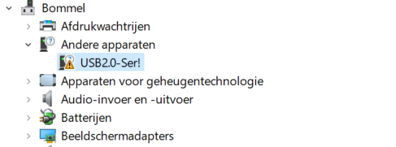
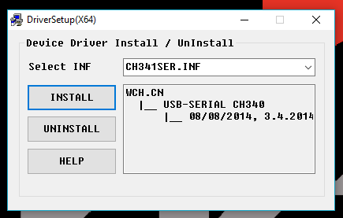

# Probleemoplosser
Help, alles gaat mis! Gelukkig hebben we hier een aantal tips om je problemen op te lossen. Het is natuurlijk altijd mogelijk om iemand om hulp te vragen. Voor alle problemen hier niet beschreven raden we aan om het volgende liedje op vol volume af te spelen: [https://youtu.be/oeCVXHPZ9WY](https://youtu.be/oeCVXHPZ9WY).

## Software
### Ik pas de kleur van de pixels aan maar ik zie de ledring niet veranderen
Als je de `setPixelColor()` functie of de `setBrightness()` gebruikt in de Neopixel library zul je eerst de `show()` functie aan moeten roepen voordat je wijzigingen op de ledring getoond worden.

### Ik krijg een error dat ik niet naar de COM poort kan schrijven of dat deze bezet is
Onder Windows mag maar één programma tegelijkertijd met een COM poort communiceren. Als je dus een seriële monitor open hebt staan en tegelijkertijd de chip probeert te programmeren werkt dat niet. Controleer of er niet per ongeluk nog een verbinding open staat.

Mogelijk zijn er twee apparaten met hetzelfde COM poort nummer. Dit is een uitzonderlijk geval en heeft vaak te maken met verbonden bluetooth apparaten. Probeer een andere USB poort te gebruiken en controleer of je de goede poort geselecteerd hebt.

Het kan gebeuren dat er wat mis gaat en de COM poort in Windows gereserveerd blijft maar dat het programma dat deze reservering plaatste al is afgesloten of is gechashed. In dat geval is de enige oplossing om je computer opnieuw op te starten.

### Ik zie alleen maar rare tekens in mijn seriële monitor
Als je seriële monitor alleen maar rare tekens laat zien is waarschijnlijk de bautrate van je monitor niet hetzelfde als dat van je microcontroller. Zoek in je code naar welke waarde dit is, bijvoorbeeld `Serial.begin(9600);` stelt de bautrate in op 9600. Zet je monitor dus op dezelfde waarde.

### Er is geen COM poort beschikbaar van de ESP
Wanneer er geen COM poort verschijnt voor de ESP als je deze met de USB kabel verbint, of het knopje voor COM poorten blijft grijs kan het zijn dat de driver niet goed geïnstalleerd is. Dit is alleen een probleem op Windows.

#### Controleren of de driver niet goed geïnstalleerd is
Om te controleren of de driver niet goed geïnstalleerd is moeten we de Device Manager (Apparaatbeheer) openen. Druk op ++windows+x++ en vervolgens op `Device Manager` of `Apparaatbeheer`. Kijk in de lijst met apparaten of je een apparaat genaamd `USB2.0-Ser!` ziet staan. Zo ja, dan zijn je drivers niet goed geïnstalleerd.

#### Correcte drivers installeren
De seriële communicate op de ESP die we jullie geleverd hebben wordt verzorgt door een CH340 chip. Hiervoor moet een correcte driver worden geïnstalleerd. Deze kun je downloaden via [https://learn.sparkfun.com/tutorials/how-to-install-ch340-drivers#drivers-if-you-need-them](https://learn.sparkfun.com/tutorials/how-to-install-ch340-drivers#drivers-if-you-need-them). Download de Windows (EXE) Driver executable en voer hem uit. Druk eerst op de `Uninstall` knop en vervolgens op de `Install` knop. Als het goed is moet je ESP nu in de Device Manager herkent worden als een COM device en een poort nummer krijgen.

## Hardware
### Als ik mijn ledring felle kleuren of veel wit laat weergeven gaat hij uit
Hoe feller en witter de kleuren, hoe meer stroom de ledring gebruikt. Als de ledring volledig wit is op volle helderheid gebruikt hij ongeveer 2A. Het kan zijn dat de voeding die je gebruikt dit niet aan kan, kijk of je de kleuren minder fel kunt maken of zet je brightness iets lager.

### Er komt rook uit mijn microcontroller!
Trek snel de USB kabel er uit! Je hebt zojuist de magische rook laten ontsnappen. Zodra de magische rook, die alle elektronica laat werken, ontsnapt is kan het niet meer gerepareerd worden. De enige oplossing is huilen in een hoekje.
