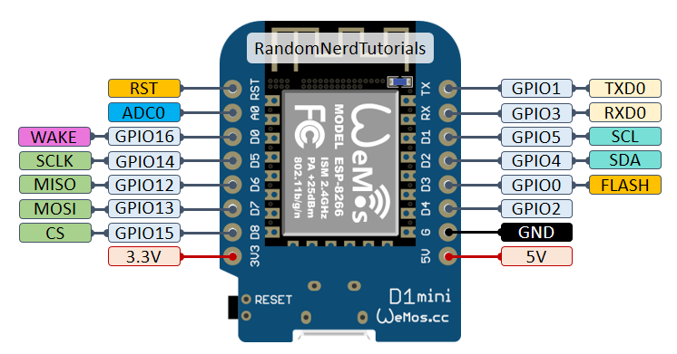
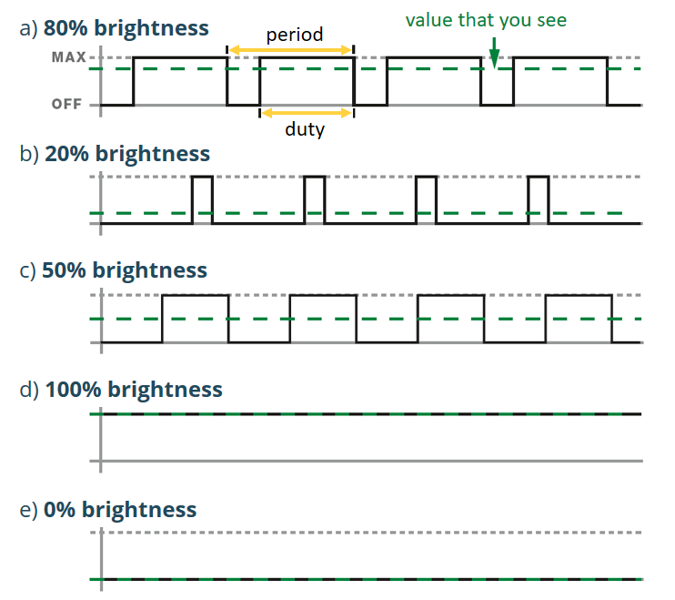

# Input & Output
Het mooie aan microcontrollers is natuurlijk dat je er elektronische componenten mee kunt aansturen en uitlezen. In dit hoofdstuk zullen we beschrijven hoe je de input en output van de microcontroller kunt gebruiken.

## Pinout
De ESP8266 die wij voor dit project gebruiken is gemonteerd op een WEMOS D1 mini development board. Daarop zijn een aantal pinnen beschikbaar zoals te zien in de onderstaande afbeelding. We zullen de functionaliteiten van elke pin hieronder uitleggen.



  - `D0 tm D8` De 9 digitale pinnen kunnen gebruikt worden als digitale input of output. Op `D0` na ondersteunen ze allemaal PWM.
  - `A0` Is een analoge input pin.
  - `RX & TX` Kunnen gebruikt worden voor Seriële communicatie.
  - `GND` Is een ground pin.
  - `3V3` Geeft een spanning van 3,3V waarop de ESP draait.
  - `5V` Geeft een spanning van 5V direct vanaf de USB voeding.

Als je meer informatie wilt over de werking en mogelijkheden van elke pin kun je kijken in de [pin reference](https://randomnerdtutorials.com/esp8266-pinout-reference-gpios/).

## Digitale Input

```arduino
pinMode(D1, INPUT);
```

```arduino
boolean value = digitalRead(D1);
```

## Digitale Output

```arduino
pinMode(D1, OUTPUT);
```

```arduino
digitalWrite(D1, HIGH);
```

## Analoge Input
```arduino
int value = analogRead(A0);
```

## PWM Output



```arduino
pinMode(D1, OUTPUT);
```

```arduino
analogWrite(D1, 512);
```
